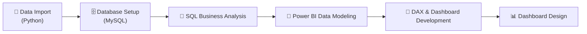
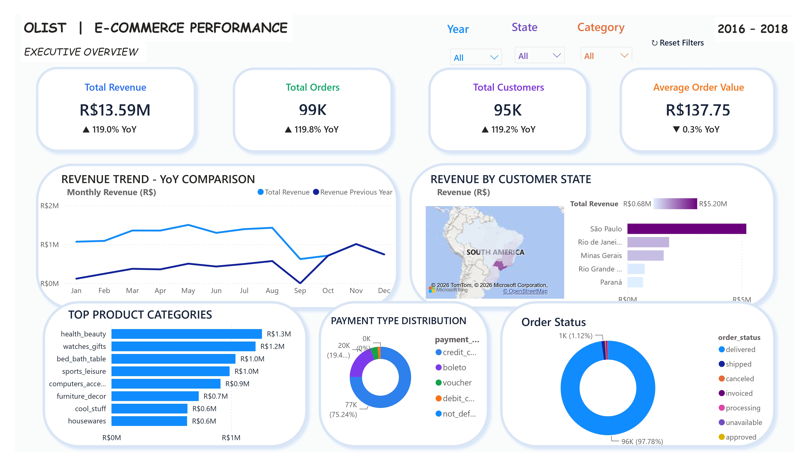
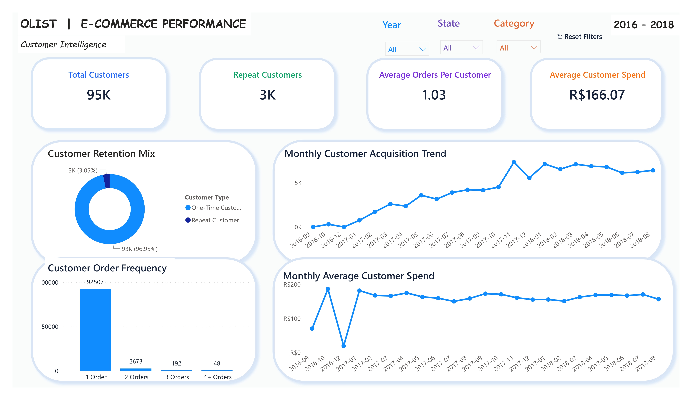
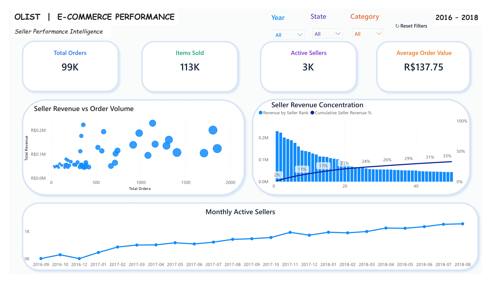

<div align="center">


<br><br>

<p align="center">
  
</p>

<br>

[]()
[]()
[]()
[]()
[]()

<br>


</div>

---

## 📊 Project Overview

**OLIST E-Commerce Performance Analytics** is an end-to-end analytics project built using **Python, MySQL, SQL, and Power BI** to analyze sales performance, customer behavior, and seller performance for a large Brazilian e-commerce marketplace.

The project transforms raw OLIST e-commerce data into business-ready analysis and an **interactive three-page Power BI dashboard**, following a complete analytics pipeline:

<div align="center">

**`Python`  ➜  `SQL`  ➜  `Power BI`**

</div>

The analysis focuses on three major business areas:

- 🏢 **Overall business performance** — revenue, orders, and growth trends
- 👥 **Customer behavior and retention** — acquisition, frequency, and repeat purchasing
- 🛍️ **Seller performance** — revenue concentration and marketplace health

---

## 🎯 Business Objectives

This project was built to answer key business questions such as:

| # | Question |
|---|---|
| 1 | How is overall revenue and order performance changing over time? |
| 2 | Which customer states generate the most revenue? |
| 3 | Which product categories contribute the most revenue? |
| 4 | What is the customer retention and repeat-purchase behavior? |
| 5 | How frequently do customers place orders? |
| 6 | How is customer acquisition changing over time? |
| 7 | Which sellers generate the highest revenue and order volume? |
| 8 | How concentrated is revenue among the largest sellers? |
| 9 | How is the active seller base changing over time? |

---

## 🗂️ Dataset

The project uses the public OLIST e-commerce dataset:

| Dataset | Description |
|---|---|
| `olist_orders_dataset` | Order-level information and order dates/status |
| `olist_order_items_dataset` | Products and sellers associated with orders |
| `olist_customers_dataset` | Customer information and geographic identifiers |
| `olist_products_dataset` | Product information and categories |
| `olist_sellers_dataset` | Seller information and locations |
| `olist_order_payments_dataset` | Payment methods and payment values |
| `olist_order_reviews_dataset` | Customer review information |
| `olist_geolocation_dataset` | Brazilian zip-code geographic information |
| `product_category_name_translation` | Portuguese-to-English product category translation |

---

## 🔧 Technology Stack

<table>
<tr>
<td valign="top" width="25%">

**Python**
- Pandas
- SQLAlchemy
- Data loading
- Data type conversion
- Date handling
- Data validation

</td>
<td valign="top" width="25%">

**MySQL**
- Database creation
- Table creation
- Relational data storage
- Analytical SQL queries

</td>
<td valign="top" width="25%">

**SQL**
- SELECT / JOINs
- GROUP BY / CASE
- Aggregate functions
- CTEs
- Window functions
- Date-based analysis

</td>
<td valign="top" width="25%">

**Power BI**
- Data modeling
- DAX
- Slicers & bookmarks
- KPI cards
- Time-series & Pareto analysis
- Maps

</td>
</tr>
</table>

---

## 🔄 Project Workflow



1. **Data Import** — Python was used to load the OLIST datasets, inspect their structure, check missing values, and convert relevant date columns before loading the data into MySQL.
2. **Database Setup** — MySQL was used to create the database and relational tables for the OLIST datasets.
3. **SQL Business Analysis** — SQL was used to calculate key metrics across orders, customers, products, sellers, payments, and other dimensions.
4. **Power BI Data Modeling** — The relational data was connected and modeled in Power BI to support interactive filtering and analysis.
5. **DAX & Dashboard Development** — DAX measures were created for KPIs, customer analysis, seller analysis, time-based comparisons, and interactive filtering.
6. **Dashboard Design** — The final report contains three analytical pages designed for different business perspectives.

---

## 📈 Power BI Dashboard

### 1️⃣ Executive Overview
High-level view of overall business performance.

**Key KPIs:** Total Revenue • Total Orders • Total Customers • Average Order Value • YoY performance

**Key Visuals:** Revenue Trend (YoY) • Revenue by Customer State • Top Product Categories • Payment Type Distribution • Order Status Distribution

Interactive **Year | State | Category** filters with a Reset Filters control.

<p align="center"></p>

---

### 2️⃣ Customer Intelligence
Customer behavior, retention, and purchasing patterns.

**Key KPIs:** Total Customers • Repeat Customers • Average Orders per Customer • Average Customer Spend

**Key Visuals:** Customer Retention Mix • Customer Order Frequency • Monthly Customer Acquisition Trend • Monthly Average Customer Spend

<p align="center"></p>

---

### 3️⃣ Seller Performance Intelligence
Seller ecosystem and seller-level revenue behavior.

**Key KPIs:** Total Orders • Items Sold • Active Sellers • Average Order Value

**Key Visuals:** Seller Revenue vs Order Volume (top 50 sellers) • Seller Revenue Concentration (Pareto) • Monthly Active Sellers

<p align="center"></p>

---

## 📌 Key Dashboard Insights

<div align="center">

### 💰 Business Performance

| Total Revenue | Total Orders | Total Customers | Avg. Order Value |
|:---:|:---:|:---:|:---:|
| **R$13.59M** | **99K** | **95K** | **R$137.75** |

### 👥 Customer Behavior

| Customers | Repeat Customers | Avg. Orders / Customer | Avg. Customer Spend |
|:---:|:---:|:---:|:---:|
| **95K** | **3K** | **1.03** | **R$166.07** |

### 🛍️ Seller Performance

| Orders | Items Sold | Active Sellers |
|:---:|:---:|:---:|
| **99K** | **113K** | **3K** |

</div>

**💡 Insight — Retention:** The customer retention analysis shows that the large majority of customers are one-time purchasers, highlighting an opportunity to improve repeat purchasing and customer retention.

**💡 Insight — Seller Concentration:** The top 50 sellers contribute roughly **one-third** of total seller revenue, indicating that revenue is distributed across a broad seller base rather than being dominated by only a few sellers.

---

## 📁 Repository Structure

```text
olist-ecommerce-performance/
│
├── data/
│
├── images/
│   ├── executive_overview.png
│   ├── customer_intelligence.png
│   └── seller_performance_intelligence.png
│
├── powerbi/
│   └── OLIST_Ecommerce_Performance.pbix
│
├── python/
│   └── import_data.py
│
├── sql/
│   ├── 01_database_setup.sql
│   ├── 02_create_tables.sql
│   └── 03_business_analysis.sql
│
├── .gitignore
└── README.md
```

---

## 🚀 How to Use This Project

1. Clone the repository
2. Run `python/import_data.py` to load the OLIST datasets into MySQL
3. Execute the SQL scripts in `sql/` in order (`01` → `02` → `03`)
4. Open `powerbi/OLIST_Ecommerce_Performance.pbix` in Power BI Desktop and refresh the data source

---

<div align="center">

**⭐ If you found this project useful, consider giving it a star!**

</div>
